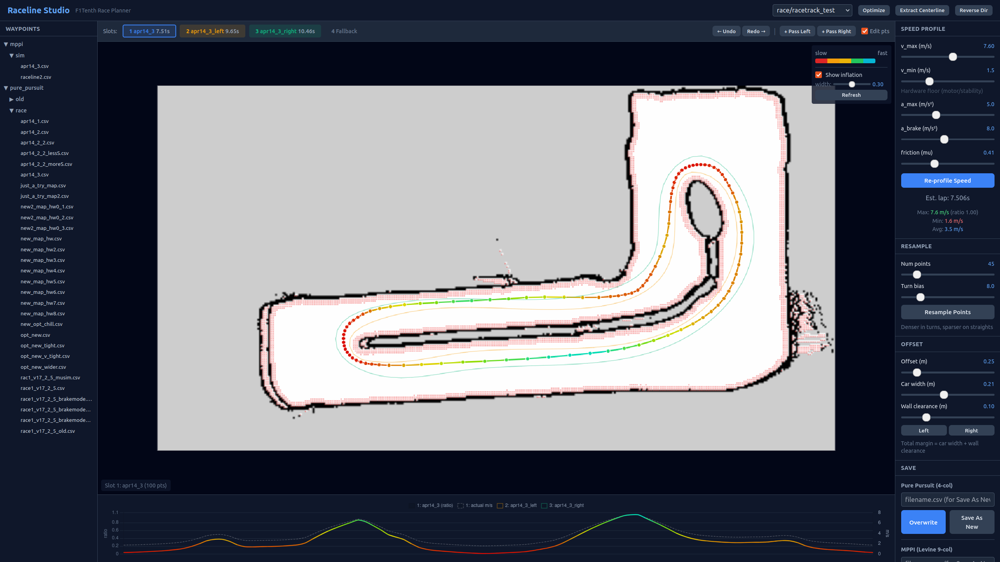

# raceline_UI_f1tenth

Web-based raceline editor for F1TENTH. Loads waypoint CSVs from a Pure Pursuit
folder and an MPPI folder, lets you edit / optimize / profile racelines, saves
back in either format (4-col Pure Pursuit or 9-col Levine MPPI), and can push
the active raceline live to a running node via a ROS2 service.



## Packages

- `raceline_msgs` — custom `UpdateRaceline.srv` used by the Push-Live feature.
- `raceline_studio` — the Flask + `rclpy` node that serves the UI.

## Setup

Edit the paths at the top of `raceline_studio/raceline_studio/app.py` to match
your workspace:

```python
PURE_PURSUIT_WAYPOINTS = "~/ros2_ws/.../pure_pursuit/waypoints"
MPPI_WAYPOINTS         = "~/ros2_ws/.../mppi_bringup/waypoints"
MAPS_DIRS              = [...]
```

Build:

```bash
cd ~/ros2_ws/roboracer_ws
colcon build --packages-select raceline_msgs raceline_studio
source install/setup.bash
```

## Run

```bash
ros2 run raceline_studio studio
```

Open `http://localhost:5050`.

## Push Live

Each format section in the Save panel has a **Push Live →** button. It sends
the active slot's waypoints over a ROS2 service (`/pure_pursuit/update_raceline`
or `/mppi/update_raceline`) directly to a running controller node, with no file
I/O. The node hot-swaps its waypoints in-memory, so you can iterate without
restarting the car. See the controller nodes' docs for the server side.

## CLI

`raceline_optimizer.py` still runs as a standalone CLI:

```bash
python3 raceline_studio/raceline_studio/raceline_optimizer.py extract map.yaml -o center.csv --show
python3 raceline_studio/raceline_studio/raceline_optimizer.py optimize center.csv map.yaml -o race.csv
python3 raceline_studio/raceline_studio/raceline_optimizer.py profile race.csv -o final.csv --vmax 5.0
```
